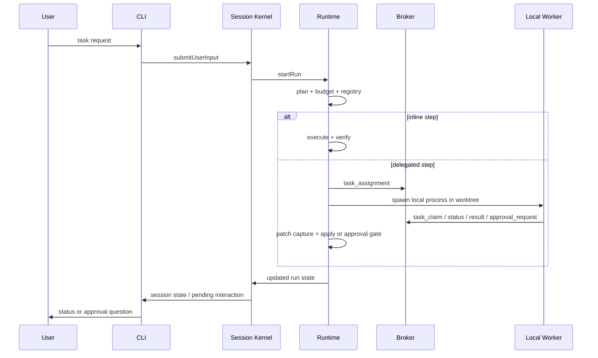

# REPL CLI Agent

This repository now ships a runnable session-oriented REPL CLI agent with leader orchestration, delegated local workers, and protocol-backed resume behavior.

## Commands

- `/help`
- `/status`
- `/runs`
- `/attach <run-id>`
- `/pause [run-id]`
- `/resume [run-id]`
- `/approve <answer>`
- `/exit`

## Happy path

## Operational notes

- The canonical source of truth is `.harness/sessions/.../runs/.../events/events.ndjson`.
- `task-registry.json` is a projection; it is rebuildable from the event stream.
- Only one active run exists per session, but historical runs remain attachable.
- Delegated workers default to git `worktree` isolation.
- Event replay rejects incompatible `protocol_header` versions before resume.

## Verification

- Standard verification: `bun test`
- Typecheck: `bun run build`
- Optional live SDK smoke: `bun test --config vitest.live.config.ts tests/live/claude-sdk.smoke.test.ts`

## Remaining gaps

- Orphan worker recovery is not complete.
- Late approval-response reconciliation after replacement/superseded requests is minimal.
- Remote teammate runtime and IM transport remain interface-only.
